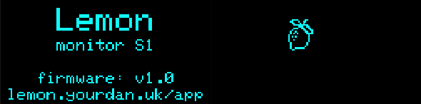
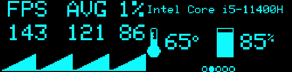
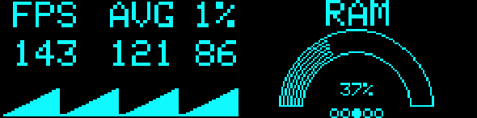
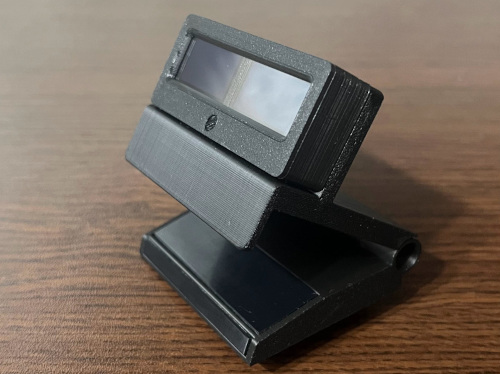
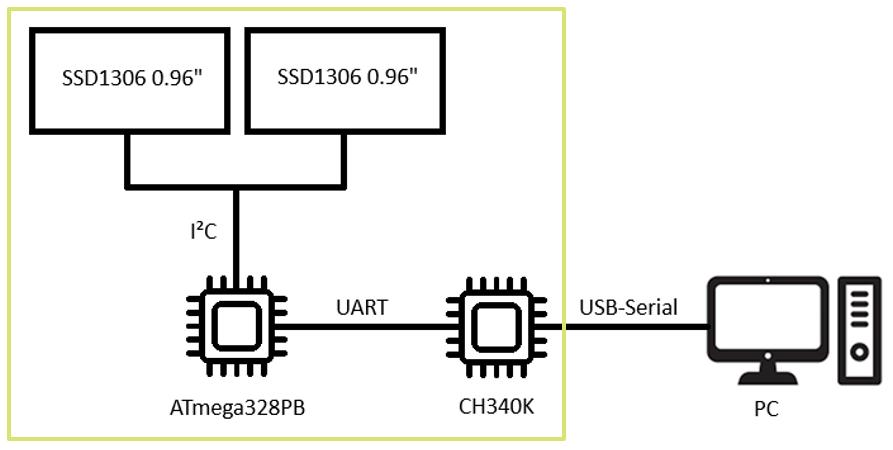
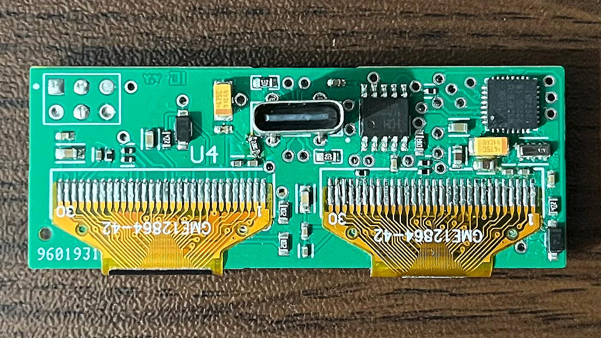

# LemonMonitor Firmware

**Lemon Monitor** is a physical, open-source hardware resource monitor designed to offload statistical data (FPS, CPU/GPU load, temps, RAM) from your main screen to a dedicated external dual-display device. This ensures your gaming experience remains immersive and clutter-free.

This repository contains the firmware source code for the Lemon Monitor hardware unit.

## 📸 Screenshots

Here is a preview of the UI in action:

| **Loading Screen** | **FPS & CPU Stats** | **RAM Usage & FPS** |
| :---: | :---: | :---: |
|  |  |  |

### UI Demo

### Magnetic Monitor Stand

## 🚀 Features

* **Real-time Monitoring:** Displays CPU and GPU temperature/load, RAM and VRAM usage, and FPS in real-time.
* **Dual Display Support:** Drives two 0.96" SSD1306 OLED displays simultaneously.
* **Ultra-Optimized:** Originally designed for the ATmega328PB microcontroller with some RAM optimization techniques to fit graphical data within 2KB of RAM.
* **Plug-and-Play:** Works via a standard USB-Serial connection.

## 🔌 Compatibility

While originally designed for a custom ATmega328PB PCB, this firmware is highly portable and supports standard Arduino boards:

* **Verified Boards:**
    * **Arduino Nano**
    * **Arduino Uno**
    * **The Original Lemon Monitor S1** (ATmega328PB Hardware)
* **Ecosystem Support:** The code is written to be compatible with **possibly every board in the Arduino ecosystem** that supports the Adafruit GFX/SSD1306 libraries and has I2C capability.

## 🛠️ Hardware Architecture

The firmware is originally designed for a custom PCB featuring:
* **Microcontroller:** ATmega328PB (20 MHz).
* **Displays:** 2x SSD1306 0.96" OLEDs connected via I2C.
* **Communication:** CH340K USB-Serial chip for PC communication.

| **Lemon monitor S1** | **Board** |
| :---: | :---: |
|  |  |

## 📦 Library Modifications

To achieve high performance and dual-display capability on limited hardware, this project utilizes **modified versions** of standard Adafruit libraries. These modifications are included in the source code:

1.  **Adafruit_SSD1306 Library:**
    * **Modification:** Added support for multiple displays.
    * *Context:* This allows the firmware to control two screens using a shared buffer technique to save RAM.

2.  **Adafruit_GFX Library:**
    * **Modification:** Removed the 2px gap when text is wrapped to a new line.
    * *Context:* This provides a tighter, more cohesive text layout on small displays.

## 💻 How to Build and Upload

This project is built using **PlatformIO**. Follow these steps to compile and upload the firmware to your device:

### Prerequisites
1.  Download and install [Visual Studio Code](https://code.visualstudio.com/).
2.  Open VS Code and install the **PlatformIO IDE** extension from the Extensions Marketplace.

### Build Steps
1.  **Clone/Download** this repository to your local machine.
2.  Open Visual Studio Code.
3.  Click on the **PlatformIO icon** (alien head) in the sidebar and select **Open Project**. Navigate to and select the folder where you saved this repository.
4.  Wait for PlatformIO to initialize the project and download necessary dependencies.
5.  Connect your Lemon Monitor device to your computer via USB.
6.  To **Build** the firmware:
    * Click the `Checkmark` (✓) icon in the bottom blue status bar.
7.  To **Upload** the firmware:
    * Click the `Arrow` (→) icon in the bottom blue status bar.
    * *Note: Ensure the correct COM port is detected. PlatformIO usually detects this automatically.*

## 🔗 Related Repositories and Website

The complete Lemon Monitor ecosystem includes a Windows desktop application and a local server:

* **Official Website:** [lemon.yourdan.uk](http://lemon.yourdan.uk)
* **Windows Application:** [LemonMonitor App](https://github.com/thr33bricks/LemonMonitor)
* **Hardware Monitor Web Server:** [LemonServer](https://github.com/thr33bricks/LemonServer/)
